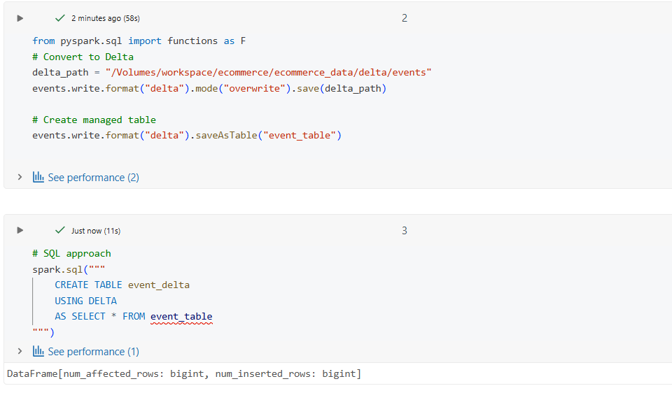
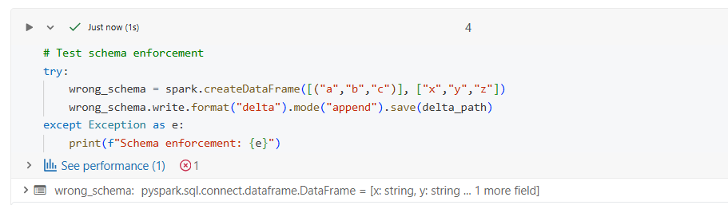
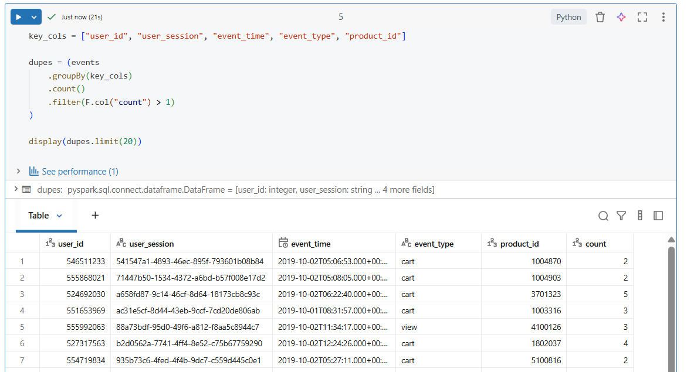

# Day 4 Completed — Delta Lake Introduction (Databricks 14 Days AI Challenge)

Today I explored **Delta Lake basics** and practiced writing data in Delta format, creating Delta tables, and checking **schema enforcement**.

---

## 📌 What I Learned Today
- What **Delta Lake** is and why it’s used in Databricks
- How Delta supports **ACID transactions** on data lakes
- **Schema enforcement** (prevents accidental wrong writes)
- Delta vs Parquet (Delta adds transaction log + reliability features)
- How to deal with **duplicate inserts** using simple checks

---

## 🛠️ Tasks I Completed
1. Converted CSV data into **Delta format**
2. Created Delta tables using **PySpark** and **SQL**
3. Tested **schema enforcement** by attempting a wrong append
4. Checked and handled **duplicate inserts**

---

## Screenshots

