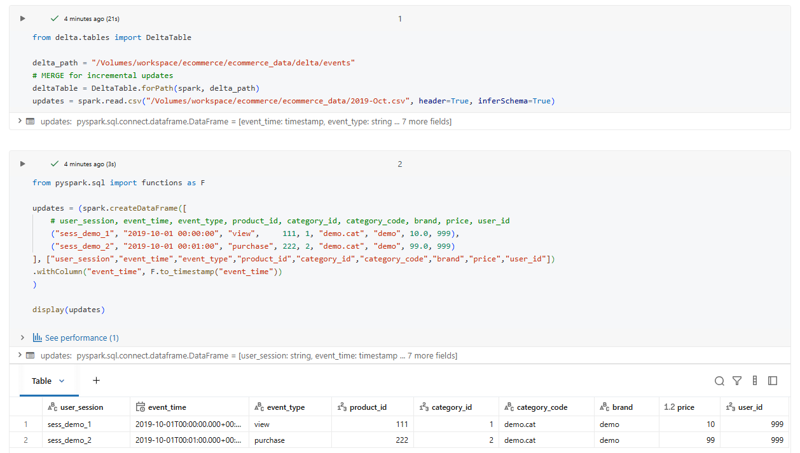
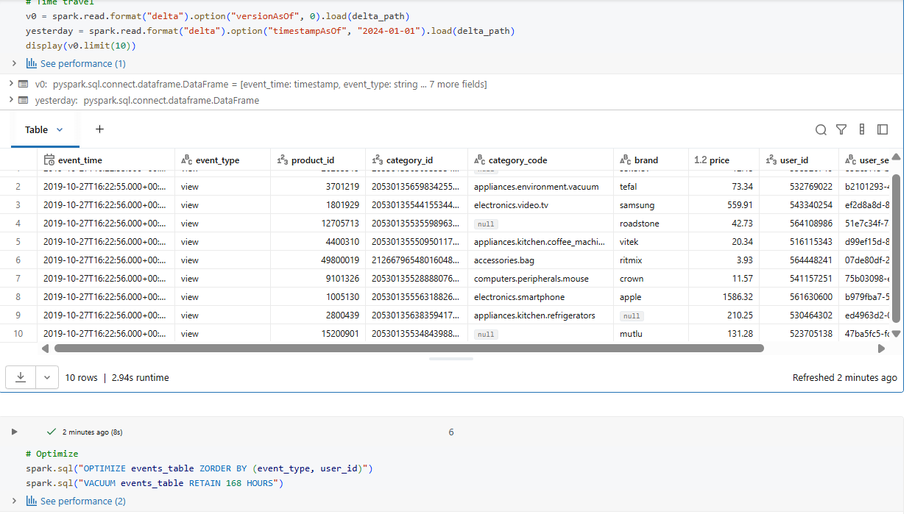
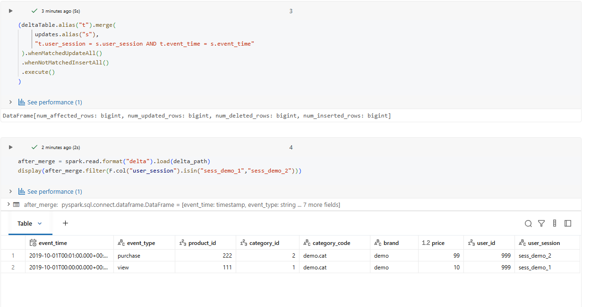

# Day 5 Completed — Delta Lake Advanced (Time Travel, MERGE, OPTIMIZE, VACUUM)

Today I practiced **Delta Lake advanced features** in Databricks: time travel, MERGE (upserts), OPTIMIZE + ZORDER, and VACUUM cleanup.

---

## 📘 What I Learned Today
- **Time travel**: query older versions of a Delta table by version or timestamp
- **MERGE**: upsert new data (update existing rows + insert new rows)
- **OPTIMIZE & ZORDER**: improve query performance by compacting files and clustering data
- **VACUUM**: remove old files to clean up storage (retention applies)

---

## 🛠️ Tasks I Completed
1. Implemented incremental **MERGE**
2. Queried **historical versions**
3. Ran **OPTIMIZE** and **ZORDER**
4. Ran **VACUUM** to clean old files

---

#### Screenshots

