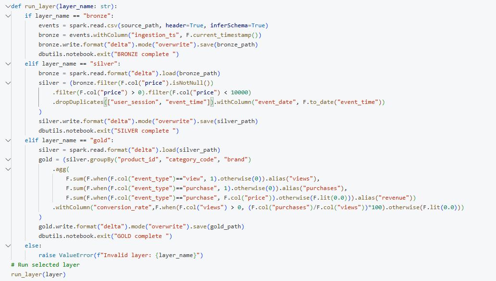
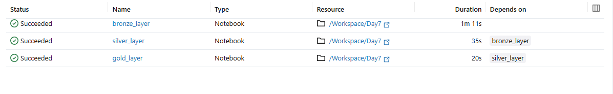
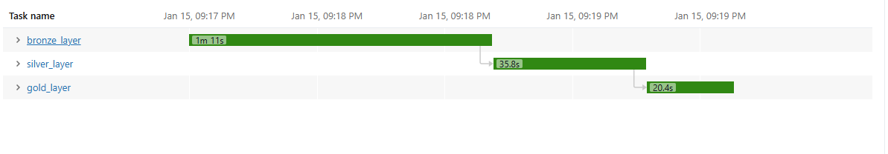
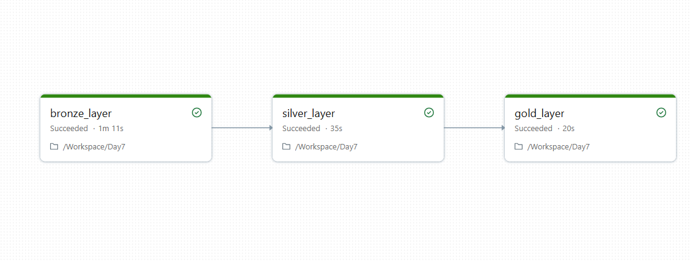

# Day 7 Completed — Databricks Jobs & Workflows (Multi-task, Parameters, Scheduling)

Today I learned how to move from “running notebooks manually” to building **repeatable Databricks Jobs** using **multi-task workflows**, notebook parameters, dependencies, and basic error handling.

---

## 📘 What I Learned Today
- Difference between **Notebooks vs Jobs**
- How to build **multi-task workflows** (Bronze → Silver → Gold)
- Using **widgets** for parameters (paths, layer selection, dates)
- How to set **task dependencies** and **scheduling**
- Basic **error handling** patterns in notebooks

---

## 🛠️ Tasks I Completed
1. Added parameter widgets to notebooks
2. Created a multi-task job for **Bronze → Silver → Gold**
3. Set task dependencies (Silver depends on Bronze, Gold depends on Silver)
4. Scheduled the workflow (e.g., daily run)

---

#### Screenshots

