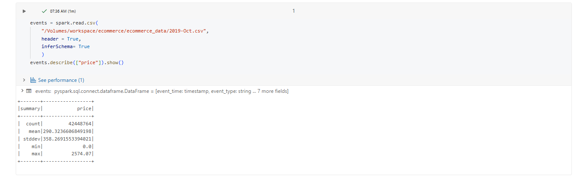
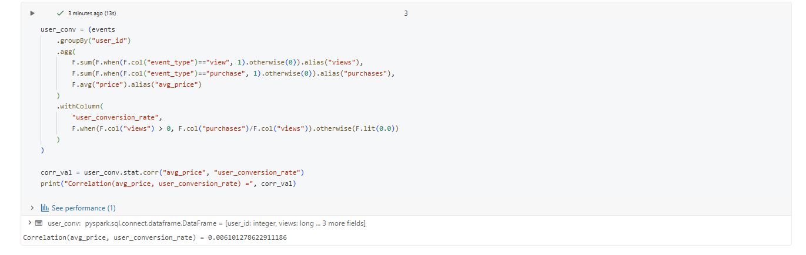
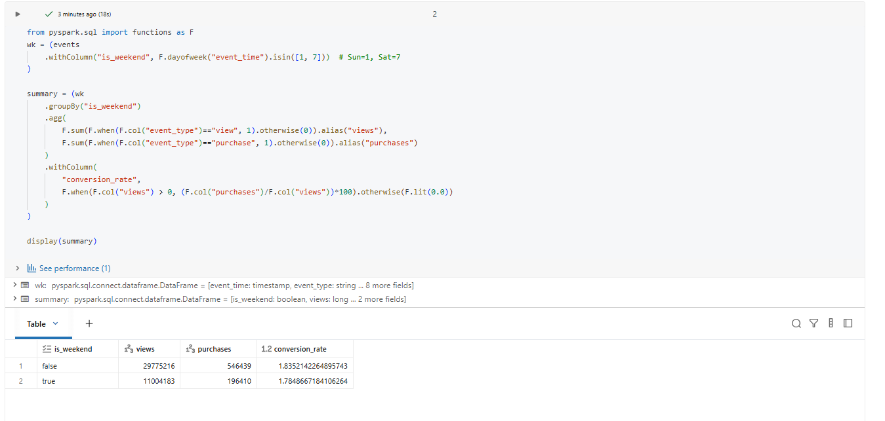
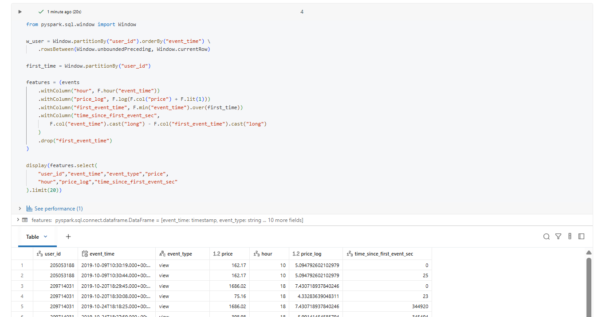

# Day 11 Completed — Statistics + Hypothesis Testing + Feature Engineering (PySpark)

Today I practiced **basic statistics** in PySpark: descriptive summaries, a simple hypothesis test idea (weekday vs weekend), correlations, and feature engineering for ML.

---

## 📘 What I Learned Today
- How to compute **descriptive statistics** (count/mean/std/min/max)
- How to compare behavior across groups (weekday vs weekend)
- How to compute **correlations** in Spark
- How to build **ML-friendly features** from timestamps and numeric fields

---

## 🛠️ Tasks I Completed
1. Calculated statistical summaries
2. Tested a hypothesis: **weekday vs weekend conversion**
3. Checked correlations (example: price vs purchases)
4. Engineered features for ML (time + log transforms + session/user features)

---

#### Screenshots

