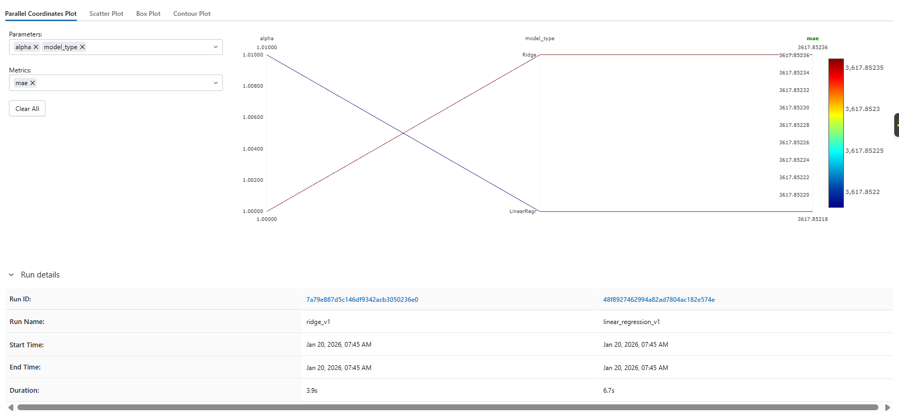
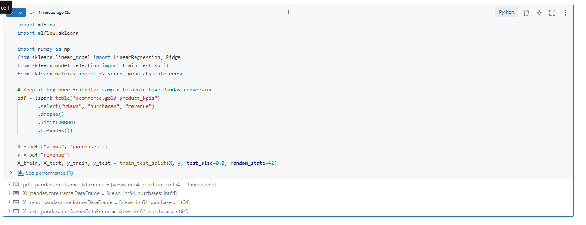
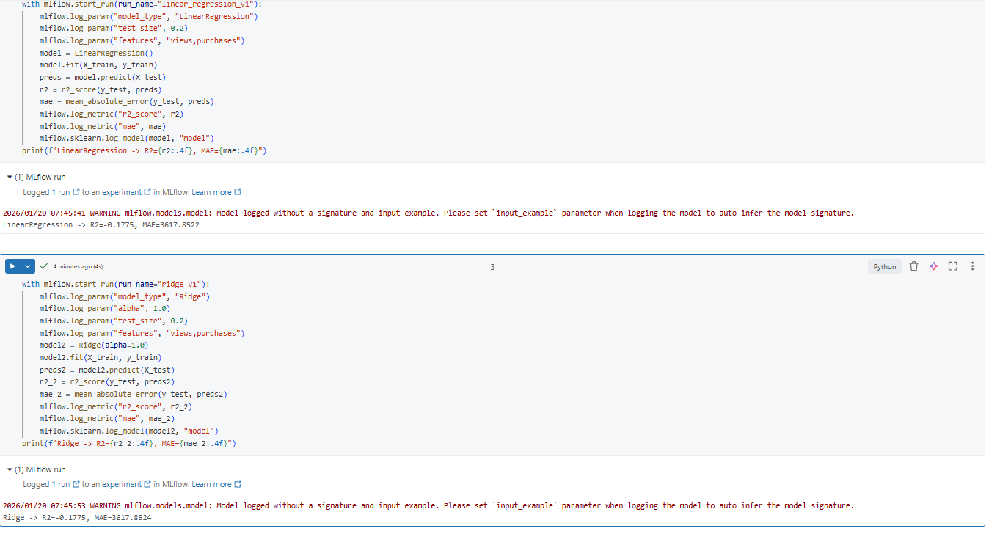
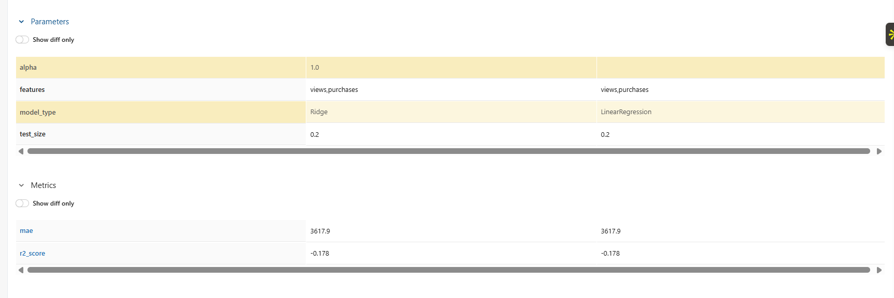

# Day 12 Completed — MLflow Basics (Tracking, Logging, UI, Compare Runs)

Today I learned the basics of **MLflow** inside Databricks: experiment tracking, logging params/metrics/models, and comparing runs in the MLflow UI.

---

## 📘 What I Learned Today
- MLflow components: **Tracking**, **Runs**, **Artifacts**, and **Model logging**
- How to log:
  - **parameters** (model type, split ratio)
  - **metrics** (R², MAE)
  - **models** (sklearn)
- How to view experiments in the **MLflow UI**
- How to compare multiple runs

---

## 🛠️ Tasks I Completed
1. Trained a simple regression model
2. Logged parameters, metrics, and model with MLflow
3. Viewed everything in MLflow UI
4. Compared multiple runs

---

#### Screenshots

