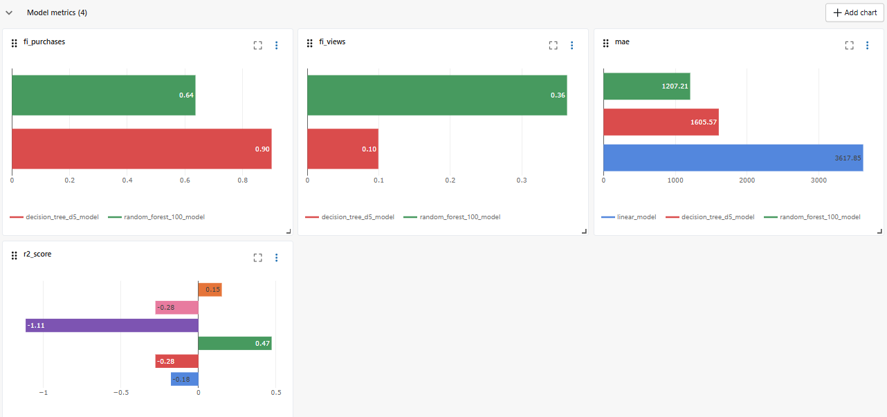
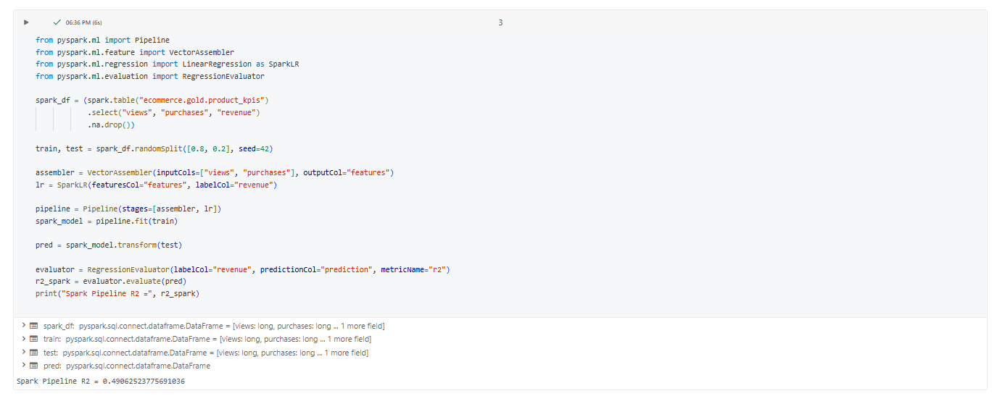
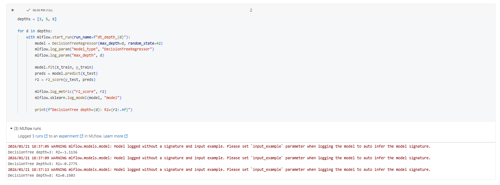
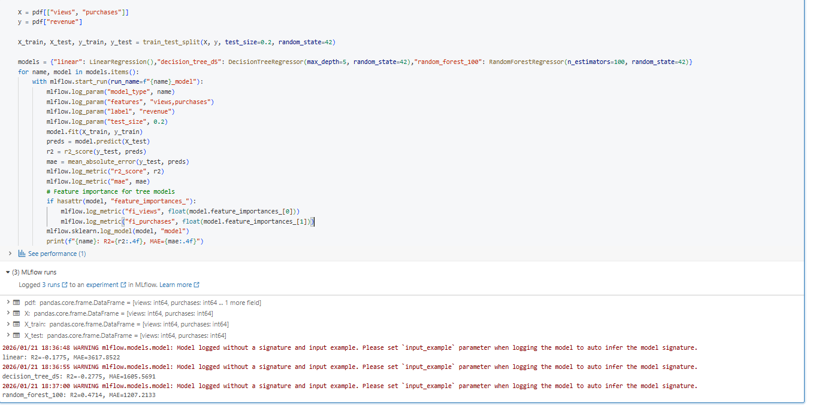

# Day 13 Completed — Model Comparison + Hyperparameter Tuning + Spark ML Pipelines

Today I trained multiple models, logged and compared results in MLflow, and built a simple **Spark ML Pipeline**.

---

## 📘 What I Learned Today
- How to train and compare **multiple models**
- Basic **hyperparameter tuning** (example: tree depth, number of trees)
- How to log and compare metrics in **MLflow**
- Basic **feature importance** (tree-based models)
- How to build a **Spark ML Pipeline** (VectorAssembler → Model)

---

## 🛠️ Tasks I Completed
1. Trained 3 different models
2. Compared metrics in MLflow
3. Built a Spark ML pipeline
4. Selected the best model based on metrics

---

#### Screenshots

