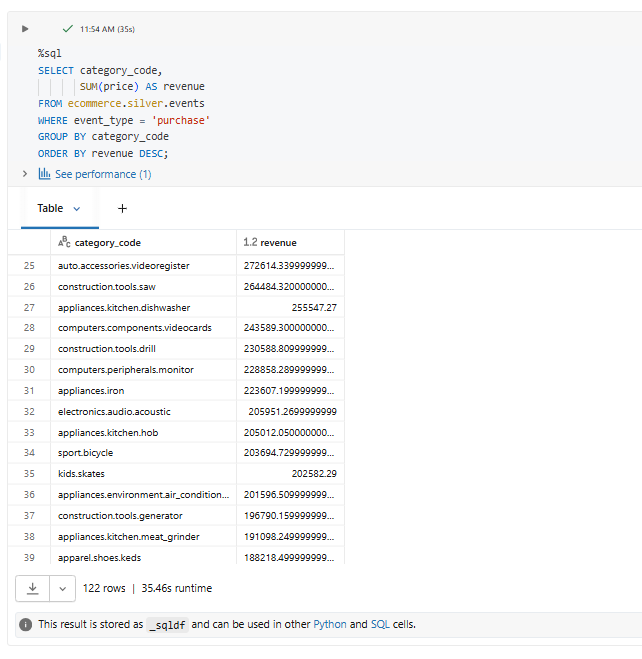
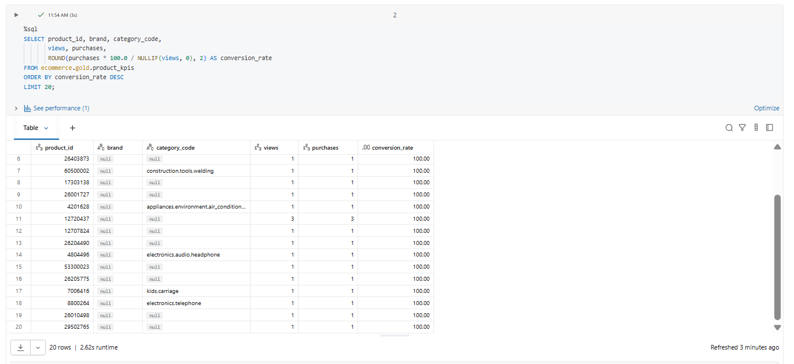
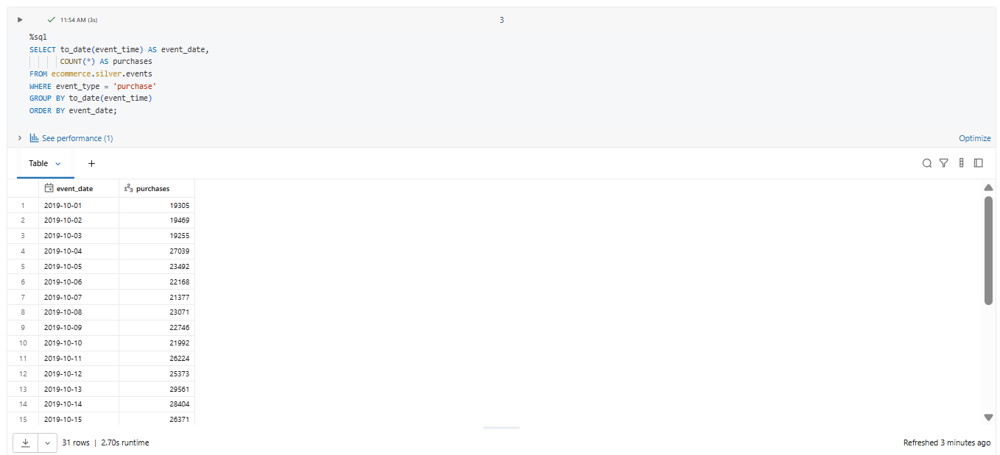
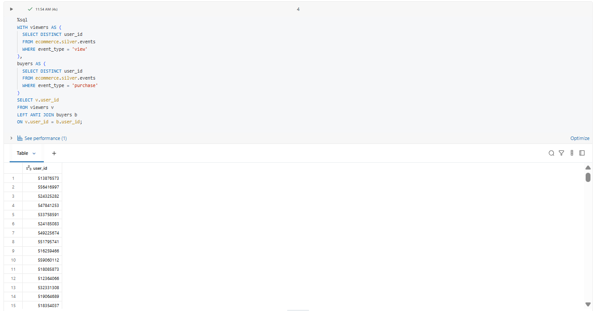
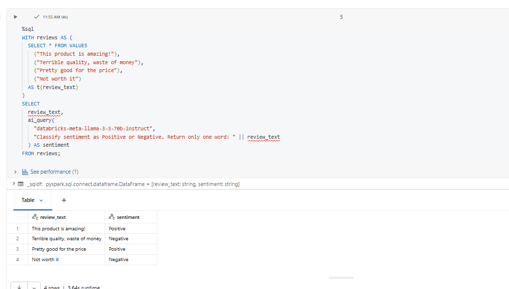
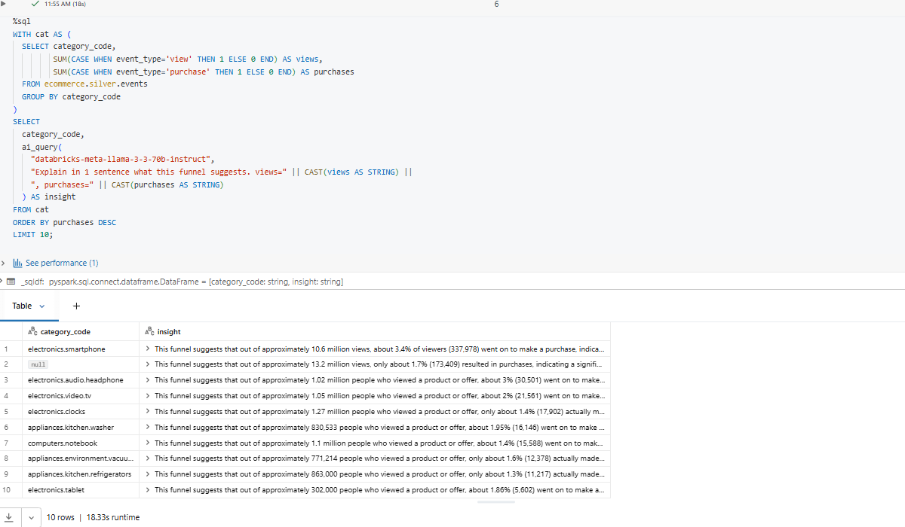
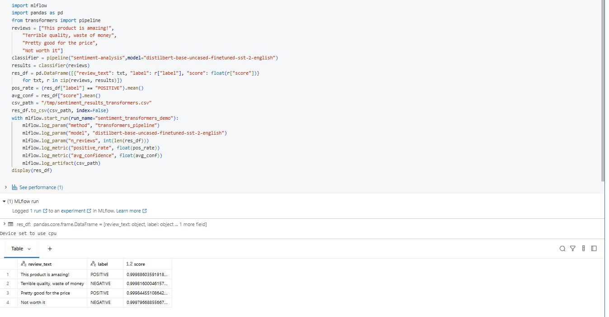
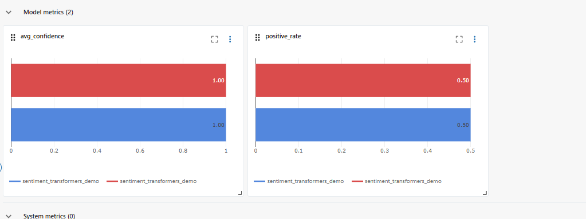
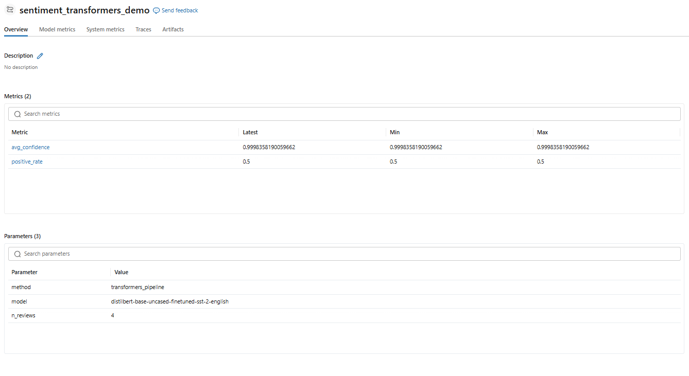

# Day 14 Completed — AI/BI Genie + Mosaic AI (GenAI-assisted Analysis)

Today I explored **Databricks AI/BI Genie** (natural language → SQL) and **Mosaic AI** capabilities for simple GenAI-powered insights.

---

## 📘 What I Learned Today
- **AI/BI Genie**: ask questions in natural language and inspect the SQL Genie generates
- How Genie depends on **space context + instructions** (tables, column meaning, sample queries)
- **Mosaic AI** overview: tools to build and operationalize GenAI apps (LLMOps, serving, governance)
- Running a simple NLP task (sentiment classification) using Databricks **AI Functions** (`ai_query`) or Transformers

---

## 🛠️ Tasks I Completed
1. Used Genie to query my e-commerce tables with natural language
2. Explored Mosaic AI features (high-level)
3. Built a simple NLP task (sentiment)
4. Generated AI-assisted insights from query outputs

---

# 1) AI/BI Genie (Natural language → SQL)

## ✅ How I set up Genie (UI)
1. Create a **Genie Space** and connect it to a SQL Warehouse
2. Add datasets (tables/views) to the space
3. Add instructions + sample queries so Genie understands business meaning
4. Ask natural-language questions and click **Show code** to view the generated SQL

(Genie setup + how responses show SQL/visuals is documented in Databricks docs.)  
Refs: Genie overview + setup + reviewing responses :contentReference[oaicite:2]{index=2}

---

## 🗣️ Genie Queries I Tried 

### A) “Show me total revenue by category”

### B) “Which products have the highest conversion rate?”

### C) “What’s the trend of daily purchases over time?”

### D) “Find customers who viewed but never purchased”

---

### Mosaic AI / AI Functions

### AI-generated funnel insights by category

